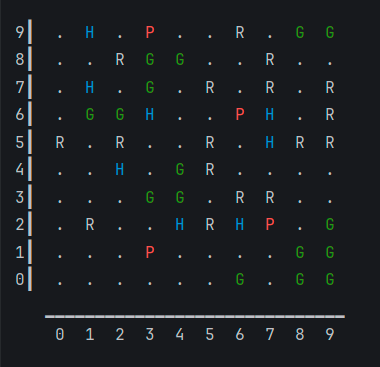

# Simulation

## Overview

The point of the project is a step-by-step simulation of a 2D world populated by herbivores and predators. In addition to creatures, the world contains resources (grass), which the herbivores feed on, and static objects with which you can't interact - they just fill the space.

The project is console-based, so it was decided to designate entities with letters of different colors.

+ Predator - **$\color{red}{\mathsf{\mathbf{P}}}$**
+ Herbivore - **$\color{#3993d4}{\mathsf{\mathbf{H}}}$**
+ Grass - **$\color{green}{\mathsf{\mathbf{G}}}$**
+ Rock - **$\color{#bcbec4}{\mathsf{\mathbf{R}}}$**

 

# Implemented features:
+ Creature actions:
  
  
  + `Herbivores`: 
    + Can either go towards the Grass or eat it.
    + When a herbivore eats grass, it heals and reduces hunger.
  
  + `Predators`:
    + Can either go towards the Herbivore or eat them.
    + When a Predator eats Herbivore, reduces hunger.

  + When a creature makes a move, its hunger increases. If the creature becomes too hungry, it will die.

+ Breadth-first search used as pathfinding algorithm.
+ Renderer displays the current state of the simulation in the console output.